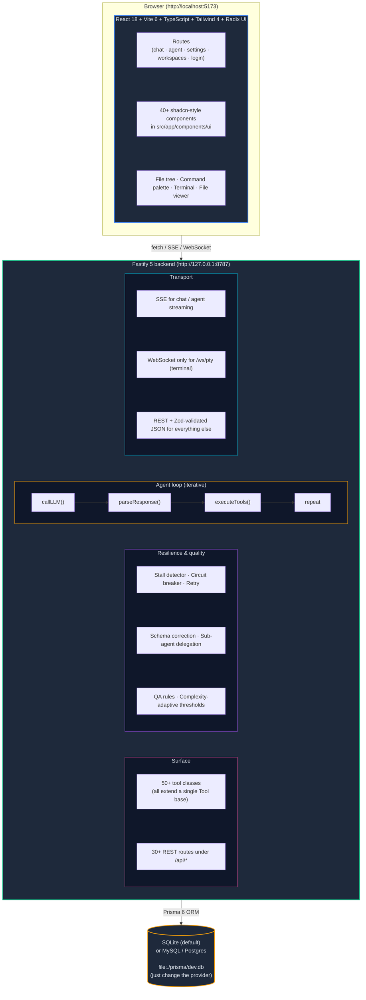

# Rapa — AI Agent Platform

<p align="left">
  <!-- Tech stack — these mirror the project's actual versions and stack. -->
  
  
  
  
  
  
  
  
  &nbsp;
  
</p>

> A self-hosted, full-stack AI agent platform with a React frontend and a
> Fastify/TypeScript backend. Users chat with LLMs in three modes — **Chat**
> (direct conversation), **Agent** (autonomous tool-using loop), and **Plan**
> (read-only analysis) — while the agent itself can read and write files,
> run shell commands, drive a headless browser, search the web, manage Git,
> and integrate with email, webhooks, and MCP servers, all bounded by a
> user-defined workspace directory.

Rapa is designed for **single-machine, personal use** by default — SQLite
for storage, no Docker, no cloud, no daemon. The same code runs as a
multi-user hosted service by switching the Prisma `provider` to MySQL or
PostgreSQL and updating the connection string. See
[docs/PERSONAL_DEPLOY.md](docs/PERSONAL_DEPLOY.md) for the full guide.

---

## Table of contents

- [Highlights](#highlights)
- [Architecture](#architecture)
- [Tech stack](#tech-stack)
- [Getting started](#getting-started)
- [Configuration](#configuration)
- [Project structure](#project-structure)
- [The agent loop](#the-agent-loop)
- [Agent tools reference](#agent-tools-reference)
- [Frontend features](#frontend-features)
- [Backend routes](#backend-routes)
- [Database schema](#database-schema)
- [MCP integration](#mcp-integration)
- [Scheduled tasks](#scheduled-tasks)
- [Security model](#security-model)
- [Testing](#testing)
- [Deployment](#deployment)
- [Common issues](#common-issues)
- [Project conventions](#project-conventions)
- [Acknowledgements](#acknowledgements)

---

## Highlights

- **Three interaction modes** — Chat, Agent, Plan, with mode-specific tool
  allowlists so the same UI serves free-form conversation and a strict
  read-only planner.
- **Workspace-scoped tool execution** — every file mutation, every shell
  command, every image write is bounded to a directory the user picked.
  Symlinks that escape the workspace are rejected.
- **50+ agent tools across 11 categories** — filesystem, code editing, shell,
  web, system, browser automation, document generation, image generation,
  scheduling, MCP passthrough, and outbound notifications/email. The
  complete list is in [§Agent tools reference](#agent-tools-reference).
- **Iterative tool-use loop** with per-iteration LLM calls, parallel
  read-only batch execution, sequential write/shell execution, automatic
  retry on transient failures, and a circuit breaker per tool.
- **Engineering Blueprint UI** — a consistent monospace, sharp-corner,
  thin-border visual language across the chat, agent steps viewer,
  file tree, command palette, and tool trace cards.
- **Persistent agent state** — tasks survive server restarts (Prisma),
  working memory is checkpointed to `.rapa/working-memory.md` per
  workspace, MCP server configs are stored encrypted.
- **SSE streaming** for chat and agent runs, **WebSocket** only for the
  embedded terminal PTY session.
- **Security-hardened diagnostics** — `read_lints` and `run_tests` strip
  `DATABASE_URL`, `APP_SECRET`, and every `*_API_KEY` from the child
  process environment before exec, fixing a credential-leakage bug.
- **Background scheduler** — cron / interval / one-shot agent runs,
  with per-task payload and run history.
- **Configurable providers** — Gemini, OpenAI, Anthropic, NVIDIA NIM,
  Ollama, Puter, and any OpenAI-compatible endpoint, with automatic
  API-key rotation when one key hits a rate limit.
- **MCP (Model Context Protocol) passthrough** — registered MCP servers'
  tools are exposed to the agent through `mcp_list_servers` and
  `mcp_call_tool`, with per-server connect caching.
- **Browser automation** — five Playwright-backed tools (`browser_navigate`,
  `browser_read`, `browser_click`, `browser_type`, `browser_evaluate`)
  that handle JS-rendered pages, auth redirects, and form submission.
- **Inline interactive widgets** — the agent can render HTML/SVG inside a
  CSP-sandboxed iframe via `render_widget`, with `script` and `on*`
  handlers stripped at the tool boundary.
- **Web-based IDE features** — a tier-by-tier file tree with right-click
  context menu, multi-select with Ctrl/Shift, inline rename, hover
  tooltips, recent files, Go-to-file (Ctrl+P) and Find-in-files
  (Ctrl+Shift+F) palettes, plus a built-in terminal (xterm.js) scoped
  to the active workspace.

---

## Architecture



**Why SSE for chat/agent and WebSocket only for the terminal?**
SSE is one-directional (server→client) which is exactly what we need for
LLM streaming. It's HTTP, so it goes through Fastify's existing
middleware, retries, and rate limiting. The terminal is the one place
that needs bidirectional I/O (keystrokes, resize events), so we use
`@fastify/websocket` for `/api/terminal/ws` only.

---

## Tech stack

### Frontend (root `package.json`)

| Dependency | Why |
|---|---|
| [React 18](https://react.dev/) | UI framework |
| [Vite 6](https://vitejs.dev/) | Dev server + production bundler |
| [TypeScript 5.8](https://www.typescriptlang.org/) | Type safety |
| [Tailwind CSS 4](https://tailwindcss.com/) | Utility-first styling |
| [React Router 7](https://reactrouter.com/) | Client-side routing |
| [Radix UI](https://www.radix-ui.com/) | 30+ unstyled accessible primitives |
| [Sonner](https://sonner.emilkowal.dev/) | Toast notifications |
| [cmdk](https://cmdk.paco.me/) | Command palette primitive |
| [Lucide React](https://lucide.dev/) | Iconography |
| [xterm.js](https://xtermjs.org/) | Embedded terminal emulator |
| [react-markdown](https://github.com/remarkjs/react-markdown) + [KaTeX](https://katex.org/) | Markdown + math rendering |
| [react-syntax-highlighter](https://github.com/react-syntax-highlighter/react-syntax-highlighter) | Code block highlighting |
| [Mammoth](https://github.com/mwilliamson/mammoth.js) / [pdf-parse](https://github.com/nickolasg/pdf-parse) | DOCX / PDF text extraction |
| [Recharts](https://recharts.org/) | Usage analytics charts |
| [Motion](https://motion.dev/) | Animations |
| [react-resizable-panels](https://github.com/bvaughn/react-resizable-panels) | Draggable layout |
| [diff](https://github.com/kpdecker/jsdiff) | Text diff display |
| [Vitest](https://vitest.dev/) + [Testing Library](https://testing-library.com/) | Tests |

### Backend (`server/package.json`)

| Dependency | Why |
|---|---|
| [Fastify 5](https://fastify.dev/) | HTTP server |
| [Prisma 6](https://www.prisma.io/) | ORM with type-safe client |
| [@modelcontextprotocol/sdk](https://github.com/modelcontextprotocol/typescript-sdk) | MCP client (stdio + HTTP + SSE) |
| [Playwright](https://playwright.dev/) (optional) | Headless browser for `browser_*` tools |
| [bcryptjs](https://github.com/dcodeIO/bcrypt.js) | Password hashing |
| [@fastify/jwt](https://github.com/fastify/fastify-jwt) | JWT auth |
| [@fastify/websocket](https://github.com/fastify/fastify-websocket) | WebSocket for terminal PTY |
| [@fastify/cors](https://github.com/fastify/fastify-cors) | CORS |
| [@fastify/rate-limit](https://github.com/fastify/fastify-rate-limit) | Per-IP rate limiting |
| [@fastify/compress](https://github.com/fastify/fastify-compress) | gzip + brotli |
| [@fastify/static](https://github.com/fastify/fastify-static) | Serves the Vite build from `web-dist/` |
| [Zod](https://zod.dev/) | Runtime schema validation |
| [node-pty](https://github.com/microsoft/node-pty) (optional) | Native PTY for `execute_command` |
| [JSZip](https://stuk.github.io/jszip/) | Optional — used by some MCP servers |
| [Vitest](https://vitest.dev/) | Tests |

---

## Getting started

### Prerequisites

- **Node.js 20+** (`node -v`)
- **Git** on PATH (the agent uses it for the `git_*` tools)
- That's it for the personal-machine setup. No MySQL, no Docker.

### Quick start (5 minutes)

```powershell
# 1. Clone
git clone <your-repo-url>
cd "Recreate UI"

# 2. Install
npm install
cd server && npm install && cd ..

# 3. Configure
Copy-Item server/.env.example server/.env
# Edit server/.env if you want non-default settings. The defaults work
# out of the box: SQLite at file:./dev.db, port 8787, default provider
# "gemini".

# 4. Initialize the database (creates dev.db + runs migrations)
cd server
npx prisma generate
npx prisma migrate dev --name init
cd ..

# 5. Start both servers (two terminals)
#    Terminal A:
cd server && npm run dev          # Fastify on 127.0.0.1:8787
#    Terminal B:
npm run dev                        # Vite on http://localhost:5173
```

Open <http://localhost:5173>. The first request auto-creates the local
user row (no signup needed for personal use — set `DISABLE_AUTH=true` if
you want to skip the login page entirely).

### Adding an AI provider

1. Open the app → **Settings** (gear icon, top-right)
2. Pick a provider — **Gemini** is recommended for first-time setup
3. Paste your API key. The key is encrypted with `APP_SECRET` (AES-256-GCM)
   before it touches the database.
4. Pick a default model.

You can register multiple keys per provider and Rapa will auto-rotate on
rate-limit errors. See [docs/AUTO_APPROVE_FEATURE.md](docs/AUTO_APPROVE_FEATURE.md)
for how the key-switch banner works.

### Adding a workspace

1. In the **left sidebar**, click **Add Workspace**
2. Pick an existing project folder (the folder must exist on disk)
3. The agent can now read and write inside that folder. Each conversation
   pins the workspace it was started with — historical conversations
   restore their original workspace when reopened.

---

## Configuration

All configuration lives in `server/.env`. The full list with defaults:

| Variable | Required | Default | Description |
|---|---|---|---|
| `DATABASE_URL` | **yes** | `file:./dev.db` | SQLite by default. Switch to `mysql://…` or `postgresql://…` for hosted. |
| `APP_SECRET` | **yes** | — | AES-256-GCM key for stored API keys. Generate with `node -e "console.log(require('crypto').randomBytes(32).toString('hex'))"`. Min 32 chars. |
| `HOST` | no | `127.0.0.1` | Network interface the API binds to. Loopback is the safe default. Set to `0.0.0.0` to expose on the LAN. |
| `PORT` | no | `8787` | API server port. |
| `DEFAULT_PROVIDER` | no | `gemini` | Default AI provider (`gemini`, `openai`, `anthropic`, `nvidia`, `ollama`, `puter`, `custom`). |
| `AGENT_LLM_TIMEOUT_MS` | no | `180000` | Per-LLM-call timeout. |
| `TOOL_OUTPUT_MAX_CHARS` | no | `10000` | Soft cap on tool result size before eviction. |
| `MEMORY_COMPACTION_THRESHOLD` | no | `24000` | History char budget before compaction kicks in. |
| `SERPER_API_KEY` | no | — | Required for the `web_search` tool to use Serper. Falls back to DuckDuckGo if unset. |
| `IMAGE_API_KEY` / `OPENAI_API_KEY` | no | — | Used by the `generate_image` tool (DALL-E / Stability / any OpenAI-compatible image API). |
| `IMAGE_API_BASE_URL` | no | `https://api.openai.com/v1` | Override the image API base URL. |
| `IMAGE_MODEL` | no | `dall-e-3` | Override the image model. |
| `DEFAULT_WORKSPACE_ROOT` | no | `process.cwd()` | Fallback workspace when no workspace is configured. |
| `CORS_ORIGINS` | no | `http://localhost:5173` | Comma-separated allowed CORS origins. |
| `LANGFUSE_PUBLIC_KEY` / `LANGFUSE_SECRET_KEY` | no | — | Enable Langfuse tracing export. |
| `LANGFUSE_BASE_URL` | no | `https://cloud.langfuse.com` | Override Langfuse host. |
| `LANGFUSE_ENVIRONMENT` | no | `production` | Environment label for Langfuse traces. |
| `AGENT_TRACING` | no | `true` | Master switch for the in-process span recorder. |
| `AGENT_TRACING_EXPORTER` | no | `console` | `console` or `off`. |

---

## Project structure

```
Recreate UI/
├── src/                                # Frontend (Vite root)
│   ├── main.tsx                        # React 18 entry
│   ├── app/
│   │   ├── routes.tsx                  # All routes & chat UI orchestration
│   │   ├── components/                 # ~40 components (see §Frontend features)
│   │   ├── components/ui/              # 40+ Radix-based shadcn-style primitives
│   │   ├── components/chat/            # Message list, input, sub-components
│   │   ├── hooks/                      # useDebounce, useTheme, useChatStream
│   │   ├── pages/                      # Page-level route components
│   │   ├── types/                      # Frontend-only types
│   │   └── __tests__/                  # Vitest tests
│   ├── lib/
│   │   ├── api.ts                      # Chat / agent REST + SSE client
│   │   ├── agent-api.ts                # Agent-specific streaming client
│   │   ├── workspace-api.ts            # File tree, search, stat, mutations
│   │   ├── tool-history.ts             # Tool-call history state
│   │   ├── provider-icons.ts           # Centralized provider icon map
│   │   └── utils.ts                    # cn() helper, etc.
│   ├── styles/                         # tailwind.css, theme.css, fonts.css
│   └── assets/                         # Provider logos, app icon
│
├── server/                             # Backend
│   ├── src/
│   │   ├── index.ts                    # Fastify entry — env, tracing, tools, routes
│   │   ├── lib/
│   │   │   ├── agent.ts                # Agent class — the iterative loop
│   │   │   ├── agent/                  # Extracted agent modules (see §The agent loop)
│   │   │   ├── suggestions.ts          # §4.5 error-recovery suggestions
│   │   │   ├── complexity.ts           # §5.3 adaptive stall detection
│   │   │   ├── scheduler-tick.ts       # §2.4 background cron/interval runner
│   │   │   ├── safety/                 # prompt-injection, dangerous-patterns
│   │   │   └── db.ts                   # Prisma + JWT + getLocalUser()
│   │   ├── routes/                     # ~30 Fastify routes
│   │   ├── tools/                      # 50+ tool classes (see §Agent tools)
│   │   ├── mcp/                        # MCP server + client
│   │   └── scripts/                    # One-off maintenance scripts
│   ├── prisma/
│   │   ├── schema.prisma               # 12 models
│   │   └── migrations/                 # 3 migrations
│   └── vitest.config.ts
│
├── docs/                               # Long-form docs (RAPA upgrade plan, etc.)
├── deck-minimax-code/                  # Companion slide deck (committed)
├── .github/                            # GitHub workflows
├── AGENTS.md                           # AI agent guide for the codebase
├── package.json                        # Frontend deps + scripts
├── vite.config.ts                      # Vite + Tailwind + path aliases
└── vitest.config.ts                     # Vitest (jsdom env for component tests)
```

---

## The agent loop

The agent loop lives in [server/src/lib/agent.ts](server/src/lib/agent.ts) and
delegates to focused modules in [server/src/lib/agent/](server/src/lib/agent/).
The composition:

```
User prompt
   ↓
prepareAgentRequest()       — DB lookups, workspace resolution, seed history
   ↓
new Agent(context, config)  — Initialize with system prompt + memory
   ↓
agent.stream(userPrompt)    — AsyncGenerator<AgentExecutionEvent>
   ↓
   For iteration in 1..maxIterations:
      callLLM()                    — POST /chat/completions (timeout + retry + circuit breaker)
      parseAssistantResponse()     — Extract JSON tool calls
      executeToolCallsInBatches()  — Read-only parallel, write sequential
                                     Resolves approvals, retries on transient errors
      ask_user?                    — End stream, return question to user
      Stall detection              — Adaptive thresholds (§5.3)
      Inject task plan / progress  — Persistent AgentTask list (§4.1)
   ↓
yield events: start, thinking, tool_call, step, assistant, done
```

### Agent modules

| Module | Purpose |
|---|---|
| `agent/llm-client.ts` | LLM HTTP call with timeout, retry, circuit breaker, key rotation |
| `agent/response-parser.ts` | JSON / XML / heuristic extraction of tool calls from LLM output |
| `agent/prompt-builder.ts` | System prompt, provider messages, broad-analysis detection |
| `agent/tool-orchestrator.ts` | Tool execution, approval flow, batching, retry, schema correction |
| `agent/tool-docs.ts` | Per-tool rich documentation rendered into the system prompt |
| `agent/prompt-builder.ts` | Broad analysis detection, direct response logic |
| `agent/reasoning-budget.ts` | Token budget allocation for reasoning vs response |
| `agent/tracing.ts` | OpenTelemetry-lite spans (Langfuse export optional) |
| `agent/supervisor.ts` | Sub-agent delegation and result aggregation |
| `agent/qa-rules.ts` | Multi-layer output QA (rules, static, LLM-as-judge) |
| `agent/working-memory.ts` | Persistent per-workspace memory file |
| `agent/context-compactor.ts` | Sliding window + summarization compaction |
| `agent/resilience.ts` | Circuit breaker, retry, timeout wrappers |
| `agent/circuit-breaker.ts` | Per-tool circuit breaker |
| `agent/retry.ts` | Exponential backoff retry |
| `agent/timeout.ts` | Configurable timeout wrapper |
| `agent/checkpoint.ts` | File checkpointing for rollback |
| `agent/code-validators.ts` | Syntax validation for generated code |
| `agent/schema-correction.ts` | Auto-correction of malformed tool call JSON |
| `agent/types.ts` | Shared TypeScript types and constants |
| `agent/complexity.ts` | §5.3 task complexity estimator |
| `agent/tool-docs.ts` | Per-tool rich documentation |

### Agent events

The `agent.stream()` async generator yields events that the frontend
SSE consumer renders in real time:

| Event | Frontend handler | Purpose |
|---|---|---|
| `start` | Sets `conversationId`, navigates URL | New conversation creation |
| `thinking` | Updates `liveReasoning` on message | Streaming reasoning display |
| `tool_call` | Updates `liveToolCalls` array | Real-time tool status (ProgressRing) |
| `assistant` | Sets message `content` | Streaming final response |
| `step` | Commits step to `agentSteps`, clears live state | Iteration boundary |
| `done` | Finalizes message, persists to DB | Stream completion |
| `error` | Sets error state | Error display (ErrorBanner) |

### Tool approval flow

```
Agent wants write/shell tool
   ↓
needsToolApproval() = true && tool NOT in autoApproveTools
   ↓
buildApprovalRequiredResult()    — Returns { requiresApproval: true, approvalId: "..." }
   ↓
waitForToolApproval()            — Promise held in pendingToolApprovals Map
   ↓
SSE event sent to frontend       — { type: "tool_call", status: "requires_approval" }
   ↓
Frontend shows approve/reject UI — ToolTraceCard inline approval prompt
   ↓
POST /api/agent/approvals         — { approvalId, approved: true/false }
   ↓
Promise resolved → tool executes (or rejected result returned)
```

---

## Agent tools reference

All tools extend a single `Tool` base class in
[server/src/lib/tools.ts](server/src/lib/tools.ts). Each tool declares
its name, description, parameters, category, risk level, and whether it
requires approval. The list below is grouped by category (the
`ToolDefinition.category` field).

### Filesystem (7 tools, all read or write)

| Tool | Risk | What it does |
|---|---|---|
| `read_file` | read | Read file contents (or a line slice via `offset`/`limit`) |
| `write_file` | write | Create or fully overwrite a file (requires approval) |
| `edit_file` | write | Surgical text replacement with fuzzy whitespace matching (requires approval) |
| `replace_in_file` | write | `edit_file` alias |
| `append_file` | write | Append to a file (requires approval) |
| `list_directory` | read | List a folder, optionally recursive |
| `search_files` | read | Glob for filenames |
| `search_content` | read | Regex / literal content search with pagination and output modes |
| `delete_file` | destructive | Delete a file or folder recursively (requires approval) |
| `rename_file` | write | Rename / move a file or folder (requires approval) |
| `mkdir` | write | Create a folder (`recursive: true` for nested) |
| `read_image` | read | Read an image as base64 (multimodal) |
| `present_file` | read | Surface one or more files as interactive cards in the chat |
| `list_changed_files` | read | Structured git status output for pre-commit workflows |

### Code editing

The `edit_file` tool tries three strategies in order: exact match,
normalized line endings, and whitespace-fuzzy. If none match, the
error includes a "closest match" hint showing the actual file content
near where the model was trying to edit, plus a reflection block
echoing the failed `SEARCH/REPLACE` block.

### Shell (5 tools)

| Tool | Risk | What it does |
|---|---|---|
| `execute_command` | destructive | Run a command (requires approval) |
| `start_process` | destructive | Long-running command in a persistent PTY session |
| `stop_process` | destructive | Kill a running process |
| `list_processes` | read | List running processes |
| `get_process_output` | read | Poll a background process for new output |

All shell tools run with `getSanitizedEnv()` — a copy of `process.env`
with `DATABASE_URL`, `APP_SECRET`, `MYSQL_*`, `POSTGRES_*`, `*_API_KEY`,
`*_API_SECRET`, `*_PRIVATE_KEY`, `JWT_SECRET`, `ENCRYPTION_KEY`, and
`LANGFUSE_*` stripped.

### Web (2 tools)

| Tool | Risk | What it does |
|---|---|---|
| `fetch_url` | read | HTTP GET/POST with optional `prompt` for AI-powered content processing |
| `web_search` | read | Serper API primary, DuckDuckGo fallback |

### System (10+ tools)

| Tool | Purpose |
|---|---|
| `think` | Internal reasoning without taking action |
| `ask_user` | Multi-question structured prompt with options |
| `summarize_progress` | Compress the current run into a summary |
| `summarize_conversation` | Full structured conversation summary |
| `plan_tasks` | Bulk-replace the task list with a fresh plan |
| `add_task` | Add a task to the persistent list (Prisma) |
| `update_task` | Mark in_progress / completed / cancelled |
| `list_tasks` | List current conversation's tasks |
| `update_working_memory` | Persist `.rapa/working-memory.md` |
| `search_memory` | Search past conversation turns |
| `delegate_task` | Spawn a sub-agent to handle a sub-problem |
| `spawn_agent` | Lower-level sub-agent spawn |
| `send_message_to_agent` | Send input to a running sub-agent |
| `cancel_agent` | Cancel a running sub-agent |
| `get_agent_status` | Query sub-agent state |
| `read_lints` | Run lint with auto-detected or explicit framework |
| `run_tests` | Run tests with auto-detected or explicit framework |

### Git (6 tools)

| Tool | Risk | What it does |
|---|---|---|
| `git_status` | read | Porcelain status |
| `git_diff` | read | Unified diff |
| `git_log` | read | Compact one-line log |
| `git_branch` | read | List local (+ remote with `-a`) |
| `git_commit` | write | Stage + commit (requires approval) |
| `list_changed_files` | read | Structured `{ changes, summary }` (prefer over `git_status` for pre-commit) |

### Browser (5 tools, Playwright)

Requires `npm install playwright && npx playwright install chromium` in `server/`.

| Tool | Risk | What it does |
|---|---|---|
| `browser_navigate` | network | Open a URL in a headless Chromium tab |
| `browser_read` | read | Read page text / HTML / title / screenshot |
| `browser_click` | write | Click a CSS selector |
| `browser_type` | write | Type into a field, optionally submit with Enter |
| `browser_evaluate` | write | Run arbitrary JavaScript in the page |

Page state is keyed by `runId || conversationId` so the same agent run
reuses its tab across multiple calls.

### Document generation (2 tools)

| Tool | Risk | What it does |
|---|---|---|
| `create_document` | write | Markdown → HTML / Word / plain text |
| `read_document` | read | Read .txt / .md / .json with truncation |

The Word output is a minimal valid OOXML document; for richer features
swap in the `docx` package later.

### Image generation (1 tool)

| Tool | Risk | What it does |
|---|---|---|
| `generate_image` | network | OpenAI-compatible `/images/generations` (DALL-E, Stability, etc.) |

If no `IMAGE_API_KEY` is set, the tool writes a 1×1 placeholder PNG so
the workflow can be tested end-to-end without a paid key.

### Media (1 tool)

| Tool | Risk | What it does |
|---|---|---|
| `render_widget` | read | Render HTML/SVG inside a CSP-sandboxed iframe |

The HTML is sanitized at the tool boundary: `<script>` blocks, `on*`
event handlers, `<iframe>/<frame>/<object>/<embed>`, `<meta http-equiv=refresh>`,
and `javascript:` URLs are all stripped.

### Scheduling (3 tools + background tick)

| Tool | Risk | What it does |
|---|---|---|
| `schedule_task` | write | Create a one-shot / interval / cron agent run |
| `list_scheduled_tasks` | read | List all tasks for the user |
| `cancel_scheduled_task` | write | Delete a task |

The background tick in `lib/scheduler-tick.ts` polls every 60 seconds
and fires any task whose `nextRunAt <= now`, creating a new
conversation + user message for each fire.

### Integration (1 tool)

| Tool | Risk | What it does |
|---|---|---|
| `send_email` | network | SMTP send via pre-registered `IntegrationCredential` |

The SMTP client is a raw TLS/STARTTLS implementation — no third-party
library, no DKIM/attachments in v1.

### Notification (2 tools)

| Tool | Risk | What it does |
|---|---|---|
| `send_notification` | network | POST to a Slack / Discord / Teams / Telegram / generic webhook |
| `list_notification_channels` | read | List configured channels (URLs redacted) |

Channel payloads are auto-formatted per provider; for generic URLs a
`{ message, format }` shape is used.

### MCP (2 tools)

| Tool | Risk | What it does |
|---|---|---|
| `mcp_list_servers` | read | Discover (server, tool) pairs and their `inputSchema` |
| `mcp_call_tool` | network | Invoke an MCP tool with arguments |

Plus `getAgentMcpToolsForUser()` returns synthetic tool definitions
that can be merged into the agent's available tool set at run time.

---

## Frontend features

The frontend is a single-page React app with a left sidebar
(conversations, workspaces, history), a main chat/agent surface, and a
right sidebar (file tree / tools / todos). The major components:

### Chat & agent

| Component | Purpose |
|---|---|
| `routes.tsx` | Top-level route + chat UI orchestration (the heart of the app) |
| `chat/message-list.tsx` | Scrollable message list with virtualization |
| `chat-input.tsx` | Message input with attachments, drag-and-drop, model selector |
| `assistant-markdown.tsx` | Markdown + KaTeX + code blocks + mermaid |
| `agent-steps-viewer.tsx` | Tool trace, reasoning panels, ProgressRing |
| `agent-run-panel.tsx` | Historical run detail view |
| `agent-run-comparison.tsx` | Side-by-side run diff for debugging |
| `interactive-options.tsx` | Multi-question user prompts |
| `mode-switch-prompt.tsx` | Mode-switch approval prompt |
| `tool-approval-dialog.tsx` | Inline approve/reject for write/shell tools |
| `tool-execution-history.tsx` | Past tool calls per run |
| `task-list.tsx` | Persistent agent task list display |
| `summarize-progress.tsx` | Conversation summary dialog |
| `error-boundary.tsx` | React error boundary |

### File tree (tier-by-tier)

| Feature | How |
|---|---|
| Right-click context menu | `workspace-file-tree.tsx` uses Radix `ContextMenu` |
| Copy absolute / relative path | Context menu items + a "Copy paths" button when multi-selecting |
| Expand all / collapse all | Per-folder + global buttons |
| Reveal in OS | `POST /api/workspaces/:id/reveal` (uses `explorer.exe /select` on Windows) |
| Open in terminal | `workspace:open-terminal` event with `cwd` |
| Search in folder | Recursive list filter |
| Refresh | `Refetch tree` button |
| New file / new folder | Custom `Dialog` matching the rest of the app |
| Rename | Inline (double-click / F2) + dialog mode (right-click) |
| Delete | Custom `AlertDialog` with destructive action styling |
| Multi-select | Ctrl/Shift-click in the tree; 43 items at once |
| Hover tooltips | Custom `HoverTooltipCard` (Radix Tooltip conflicts with ContextMenu) |
| Recent files | localStorage-persisted, top of tree |
| Go-to-file (Ctrl+P) | `CommandDialog` from `components/ui/command.tsx` |
| Find-in-files (Ctrl+Shift+F) | Same primitive, content search |
| Built-in terminal | `terminal-view.tsx` (xterm.js) + `terminal-dialog.tsx` |

### Settings

- `settings-page.tsx` — Provider settings, model management
- `service-keys-settings.tsx` — API key management
- `appearance-page.tsx` — Theme customization
- `agent-settings-page.tsx` — Auto-approve, max iterations, rules
- `agent-specialists-page.tsx` — Sub-agent specialist configuration
- `usage-analytics-page.tsx` — Token usage charts
- `add-custom-provider.tsx` — Custom OpenAI-compatible provider form
- `login-page.tsx` — Authentication

### UI primitives (`src/app/components/ui/`)

40+ Radix-based shadcn-style primitives: accordion, alert-dialog,
aspect-ratio, avatar, checkbox, collapsible, command, context-menu,
dialog, dropdown-menu, hover-card, label, menubar, navigation-menu,
popover, progress, radio-group, scroll-area, select, separator, sheet,
slider, switch, tabs, toast, toggle, toggle-group, tooltip, and more.

---

## Backend routes

All routes live under `/api/` and return JSON. SSE for chat/agent
streaming, WebSocket for the terminal PTY. Zod-validated request
bodies; JWT-validated auth (except `/api/auth/*` and `/api/health`).

| Route | Method | Purpose |
|---|---|---|
| `/api/health` | GET | Liveness check |
| `/api/auth/*` | POST | Login, signup, refresh, logout |
| `/api/chat/stream` | POST | SSE — Chat mode streaming |
| `/api/agent/execute/stream` | POST | SSE — Agent mode streaming |
| `/api/agent/execute/control` | POST | Pause / resume / redirect / abort an in-flight agent run |
| `/api/agent/approvals` | POST | Resolve a pending tool approval |
| `/api/agent/tools` | GET | List all available tools for the current mode |
| `/api/agent/tools/validate` | POST | Validate a tool call's parameters |
| `/api/agent/mcp/servers` | GET / POST / DELETE | Manage MCP server registrations |
| `/api/conversations` | GET / POST | List / create conversations |
| `/api/conversations/:id` | GET / PATCH / DELETE | Read / rename / delete |
| `/api/workspaces` | GET / POST | List / create workspaces |
| `/api/workspaces/:id` | GET / PATCH / DELETE | Manage workspaces |
| `/api/workspaces/:id/tree` | GET | Recursive file tree |
| `/api/workspaces/:id/file` | GET / POST | Read raw / create empty file |
| `/api/workspaces/:id/path` | GET / PATCH / DELETE | Read / rename / move / delete |
| `/api/workspaces/:id/folder` | POST | Create folder |
| `/api/workspaces/:id/duplicate` | POST | Duplicate a file |
| `/api/workspaces/:id/raw` | GET | Read raw bytes (used by file viewer) |
| `/api/workspaces/:id/reveal` | POST | Open the OS file manager at a path |
| `/api/workspaces/:id/stat` | GET | `{ size, mtime, isDirectory, childCount }` |
| `/api/workspaces/:id/files/match` | GET | Fuzzy file path search (Go-to-file) |
| `/api/workspaces/:id/search` | GET | Full-text content search (Find-in-files) |
| `/api/settings` | GET / PATCH | Provider + model settings |
| `/api/service-keys` | GET / POST / PATCH / DELETE | API key CRUD |
| `/api/mcp/remote/*` | GET / POST | Remote MCP server list + call |
| `/api/terminal/ws` | WS | PTY session (xterm.js) |

---

## Database schema

Twelve Prisma models live in [server/prisma/schema.prisma](server/prisma/schema.prisma):

| Model | Purpose |
|---|---|
| `AppUser` | The local user. Single-user by default; multi-user when hosted. |
| `Workspace` | A directory the agent can read/write. Pinned to conversations. |
| `ProviderSetting` | Per-provider config (baseUrl, models, enabled flag) |
| `ProviderApiKey` | Encrypted API keys, one row per key, with active flag for auto-rotate |
| `Conversation` | A chat thread. Has a workspace, a list of messages, agent rules, etc. |
| `Message` | User / assistant / system turn. Stores the model + provider + reasoning effort. |
| `AgentRun` | One row per agent run. Stores steps, tool calls, checkpoints, process sessions. |
| `AgentRunStep` | One row per iteration in an agent run. |
| `AgentToolCall` | One row per tool invocation with parameters, result, approval metadata. |
| `AgentCheckpoint` | File snapshot for rollback. |
| `AgentProcessSession` | Long-running shell process tracking. |
| `AgentRule` | User-defined rules at global / workspace / conversation scope. |
| `AgentSkill` | Installable agent skill definitions. |
| `AgentIntegration` | External service integration metadata. |
| `AgentMcpServer` | MCP server configuration. |
| `AgentTask` | §4.1 persistent task list. Replaces the old in-memory Map. |
| `NotificationChannel` | §3.3 webhook channels (Slack / Discord / Teams / Telegram). |
| `ScheduledTask` | §2.4 scheduled agent runs (at / every / cron). |
| `IntegrationCredential` | §3.2 SMTP / OAuth credentials for integration tools. |
| `UsageRecord` | Per-call token usage for analytics. |
| `ServiceApiKey` | Encrypted service API keys (Serper, etc.). |
| `AutoApprovePattern` | User-defined auto-approve rules for tool calls. |

Three migrations in `prisma/migrations/`. Run `npx prisma migrate dev`
to apply them on first setup.

---

## MCP integration

The MCP client in [server/src/mcp/client.ts](server/src/mcp/client.ts)
supports three transports:

- **stdio** — Spawns a child process and speaks JSON-RPC over its stdin/stdout
- **SSE** — Old-school HTTP+SSE transport
- **streamableHttp** — Modern streamable HTTP transport

Connections are cached per server id; reusing an existing connection
avoids the cost of a new spawn on every tool call.

To register an MCP server:
1. Open **Settings → MCP Servers** in the UI
2. Pick the transport, paste the command / URL, save
3. The next agent run will pick up the new server's tools via
   `mcp_list_servers` (or, when wired into the loop's tool set, they
   appear with names like `mcp_<server>__<tool>`)

---

## Scheduled tasks

The scheduler in [server/src/lib/scheduler-tick.ts](server/src/lib/scheduler-tick.ts)
polls every 60 seconds. Supported schedule kinds:

| Kind | Payload | Example |
|---|---|---|
| `at` | ISO timestamp in the future | One-shot at `2026-12-31T09:00:00Z` |
| `every` | `everyMs` ≥ 1000 | Every 5 minutes |
| `cron` | 5-field cron expression | `0 9 * * *` = 9 AM daily |

`tz` is stored but treated as a hint — the cron evaluator uses UTC
fields (so `0 9 * * *` means 9 AM UTC). For full tz support swap in
`cron-parser` later.

Each fire creates a new `Conversation` titled `[Scheduled] <task name>`
and a user message with the task's payload. A new agent run is then
initiated by opening the conversation; the user can browse the
conversations in the sidebar to see what fired.

---

## Security model

### Workspace boundary

Every filesystem tool validates the target path:

- Absolute paths are rejected (`containsPathTraversal`)
- `..` segments are rejected
- After lexical checks, `realpath` resolves symlinks and the resolved
  path is checked again. A symlink inside the workspace that points
  outside is rejected; a symlink outside that points inside is also
  rejected.

### Shell environment

All shell-execution tools use `getSanitizedEnv()` (defined in
[server/src/tools/shell.ts](server/src/tools/shell.ts)). The sanitized
env strips these patterns (case-insensitive):

```
APP_SECRET, DATABASE_URL, MYSQL_*, POSTGRES_*, MONGO_*, REDIS_*,
*API_KEY*, *API_SECRET*, *PRIVATE_KEY*, *ACCESS_TOKEN*,
JWT_SECRET, ENCRYPTION_KEY, LANGFUSE_*
```

### API keys

Stored encrypted with AES-256-GCM using `APP_SECRET` as the key.
Encryption helpers live in [server/src/lib/crypto.ts](server/src/lib/crypto.ts).
The key never leaves `process.env` after startup.

### Tool approval

Write and shell tools default to `requiresApproval: true`. The user
can configure auto-approve patterns via Settings or via inline
`autoApproveTools` per agent run.

### Tool output sanitization

LLM-emitted tool results are wrapped in `<untrusted_tool_output>` tags
and a `wrapUntrustedContent` function makes the prompt-injection
detector see the boundary. See [server/src/lib/safety/prompt-injection.ts](server/src/lib/safety/prompt-injection.ts).

### Sanitization §4.3

`read_lints` and `run_tests` previously passed `process.env` directly
to child processes, leaking `DATABASE_URL`, `APP_SECRET`, and every
`*_API_KEY` to workspace code. Fixed in v0.1.0.

---

## Testing

The project ships with **373 tests** across 35+ files. All pass on
the latest commit.

```powershell
# Frontend (47 → 56 tests with the workspace-file-tree additions)
npm test

# Backend (317 tests)
cd server && npm test
```

### Test breakdown

- **Frontend (56 tests)**
  - Chat types and utility functions
  - Chat utility helpers
  - Router smoke tests
  - `top-bar` smoke tests
  - `sidebar` smoke tests
  - **`workspace-file-tree-bulk-delete`** — the new dedup logic

- **Backend (317 tests)**
  - Agent loop modules: envelope, response parser, tool docs, tool
    orchestrator, tracing, supervisor, LLM client, resilience
  - **Complexity estimator** (§5.3)
  - **Suggestion helpers** (§4.5)
  - **Scheduler tick** (§2.4)
  - **Diagnostics** (§4.3)
  - Safety modules: prompt injection detection, dangerous pattern
    matching
  - Infrastructure: crypto, env, tool scopes, run limits, exit hatch,
    MCP server, working memory, reasoning translator

### Build verification

```powershell
# Frontend production build (Vite)
npm run build
# → web-dist/

# Backend production build (tsc)
cd server && npm run build
# → server/dist/
```

---

## Deployment

### Personal-machine (default)

Two terminals, one for `server/`, one for the root. Open
<http://localhost:5173>. See [docs/PERSONAL_DEPLOY.md](docs/PERSONAL_DEPLOY.md)
for the full guide.

### Docker

`Dockerfile` + `docker-compose.yml` ship with the project:

```bash
docker compose up --build
```

### Hosted (multi-user)

1. Change `provider` in [server/prisma/schema.prisma](server/prisma/schema.prisma)
   to `"postgresql"` (or `"mysql"`)
2. Set `DATABASE_URL` to the hosted connection string
3. Set `HOST=0.0.0.0` (or run behind a reverse proxy)
4. Set `CORS_ORIGINS` to the public frontend URL
5. Run `npx prisma migrate deploy`
6. `cd server && npm run build && npm start`

### Reverse proxy

For production behind nginx / Caddy / Cloudflare, the typical
config is to proxy `https://your-domain.com/api/*` and
`https://your-domain.com/terminal` (WebSocket) to
`http://127.0.0.1:8787` and serve `web-dist/` for everything else.

---

## Common issues

### "No agent tools were registered"

`registerAllTools()` failed. Check the backend logs for the actual
import error. Usually a missing dependency in `server/`.

### "Missing API key. Configure provider in Settings first."

Open Settings → pick provider → paste the key → save. Verify
`isActive: true` is set on at least one key for the provider.

### Database is locked

The SQLite file is being held by another process. If the dev server
isn't running, the lock is from a stray process. On Windows:

```powershell
Get-Process node | Where-Object { $_.Path -like "*Recreate UI*" } | Stop-Process
```

### PTY session not starting on Windows

`node-pty` requires Windows build tools. The shell tool falls back
to `child_process.exec` if PTY fails to spawn. To enable the real
PTY, install Visual Studio Build Tools 2022 with the "Desktop
development with C++" workload.

### Prisma "Too many connections" (MySQL/Postgres only)

```prisma
datasource db {
  url = "mysql://...?connection_limit=5"
}
```

SQLite is a single-process engine and doesn't have this problem.

### Large chunk warnings during build

The main bundle is ~570 KB gzipped. This is a known issue — the
vendor chunks (Radix, syntax highlighter, markdown) are large. The
fix is route-level code splitting with `React.lazy()`, which is
partially applied but not exhaustively.

---

## Project conventions

- **TypeScript strict mode** — `no any`, prefer `unknown` with narrowing
- **Named exports only** — no default exports
- **Type over interface** — the project uses `type` for most definitions
- **Kebab-case files**, **PascalCase components**, **camelCase functions**,
  **UPPER_SNAKE_CASE constants**, **PascalCase + "Tool" suffix for tools**
- **Backend uses `.js` import extensions** (NodeNext module resolution)
- **Frontend uses `@/` alias** for absolute imports
- **Commit format:** [Conventional Commits](https://www.conventionalcommits.org/)
  (`feat:`, `fix:`, `refactor:`, `chore:`, `docs:`, `test:`)
- **Tests must pass before committing** (`npm test` in both root and `server/`)
- **All new tools need a doc block** in
  [server/src/lib/agent/tool-docs.ts](server/src/lib/agent/tool-docs.ts) so the
  LLM knows when to reach for them

### Before merging

1. `cd server && npx tsc --noEmit` — backend compiles
2. `npm run build` — frontend bundles
3. `npm test` and `cd server && npm test` — all tests green
4. Manual smoke test: open app, send a chat message, send an agent
   message, verify the file tree updates
5. No commented-out code or stray `console.log`
6. Migration files reviewed for correctness

For the full agent guide see [AGENTS.md](AGENTS.md).

---

## Acknowledgements

Rapa is built on the shoulders of giants. The framework study in
[docs/research/agentic-capabilities-roadmap.md](docs/research/agentic-capabilities-roadmap.md)
informed the agent loop architecture, and the tool design draws
inspiration from:

- [QoderWork](https://qoder.com) — 30+ tool patterns, scheduling model
- [Anthropic Claude Agent SDK](https://github.com/anthropics/anthropic-sdk-python) —
  planner/worker sub-agent pattern
- [Odysseus](https://odysseus.ai) — state-as-graph checkpoints, conversation memory
- [AutoBe](https://github.com/samchon/autobe) + [Typia](https://typia.io) —
  "if you can verify, you converge" tool-call validation
- The [LangChain](https://langchain.com) /
  [LangGraph](https://langchain-ai.github.io/langgraph/) community —
  conversation compaction, tracing patterns
- The [Model Context Protocol](https://modelcontextprotocol.io) spec —
  tool calling, server lifecycle

Built and maintained by the Rapa team. Contributions welcome — open
a PR and we'll review within a week.
